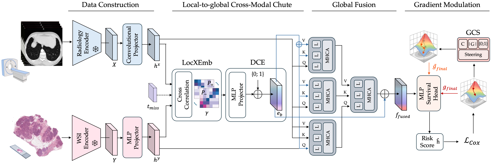

# 🪂 PaRaChute

## Introduction
This repository contains the implementation for the WACV 2026 paper "PaRaChute: Pathology-Radiology Cross-Modal Fusion for Missing-Modality-Robust Survival Prediction".


## Setup
Create the Conda environment:

```bash
conda env create -f environment.yml
conda activate parachute
pip install -r requirements.txt
```

## Data
We use three publicly available multimodal cancer datasets:
- CPTAC-PDA: Pancreatic Ductal Adenocarcinoma preoperative CT volumes and H&E WSI with clinical metadata (grading and survival) from CPTAC, hosted on TCIA. [TCIA collection](https://www.cancerimagingarchive.net/collection/cptac-pda/),  [CPTAC consortium](https://proteomics.cancer.gov/programs/cptac)
- CPTAC-UCEC: Uterine Corpus Endometrial Carcinoma preoperative CT volumes and WSI histopathology with clinical and survival metadata from CPTAC, hosted on TCIA. [TCIA collection](https://www.cancerimagingarchive.net/collection/cptac-ucec/),  [CPTAC consortium](https://proteomics.cancer.gov/programs/cptac) 
- MMIST-CCRCC: Clear Cell Renal Cell Carcinoma (ccRCC) benchmark curated from CPTAC-CCRCC (TCIA) and TCGA-KIRC (GDC). [MMIST dataset page](https://multi-modal-ist.github.io/datasets/ccRCC/),  [CPTAC-CCRCC collection](https://www.cancerimagingarchive.net/collection/cptac-ccrcc/),  [TCGA-KIRC (GDC)](https://portal.gdc.cancer.gov/projects/TCGA-KIRC) 

Splits and labels are stored under `data/labels_splits/<dataset>/` (for example `data/labels_splits/CPTACPDA/k=all.tsv`). The CPTAC-PDA and CPTAC-UCEC splits follow the ones from [Patho-Bench](https://github.com/mahmoodlab/Patho-Bench) for consistency, while the MMISTCCRCC splits were generated by us.

## Features
CT volume features (after preprocessing) are extracted with [MedImageInsights](https://huggingface.co/lion-ai/MedImageInsights
) 
Histopathology features are extracted with [TITAN](https://github.com/mahmoodlab/TITAN) through the [Trident framework](https://github.com/mahmoodlab/TRIDENT)

Expected structure:

```text
data/features/
  CPTACPDA/
    MedImageInsights/<CASE_ID>/*.npy (or .pt)
    TITAN/*.h5
  CPTACUCEC/
    MedImageInsights/<CASE_ID>/*.npy (or .pt)
    TITAN/*.h5
  MMISTCCRCC/
    MedImageInsights/<CASE_ID>/*.npy (or .pt)
    TITAN/*.h5
```

Notes:
- CT features are loaded from per-patient folders (`ct_path/<case_id>/*.npy` or `.pt`) and were extracted with MedImageInsights.
- WSI features are `.h5` files with a `features` dataset, extracted with TITAN via Trident.
- Make sure the feature dimensions match the config (`rad_input_dim`, `histo_input_dim`, `n_patches`).

## Directory Structure And Outputs
Repository layout (top level and key subfolders):

```text
.
├── README.md
├── data/
│   ├── features/
│   │   ├── CPTACPDA/
│   │   │   ├── MedImageInsights/
│   │   │   └── TITAN/
│   │   ├── CPTACUCEC/
│   │   │   ├── MedImageInsights/
│   │   │   └── TITAN/
│   │   └── MMISTCCRCC/
│   │       ├── MedImageInsights/
│   │       └── TITAN/
│   └── labels_splits/
│       ├── CPTACPDA/
│       ├── CPTACUCEC/
│       └── MMISTCCRCC/
├── models/
│   ├── ckpts/
│   └── parachute/
├── scripts/
│   ├── presets/
│   │   ├── titan_cptacpda/
│   │   ├── titan_cptacucec/
│   │   └── titan_mmist_ccrcc/
│   ├── test.py
│   ├── train.py
│   └── train_multival.py
├── training/
│   ├── losses.py
│   ├── metrics.py
│   ├── survival_trainer.py
│   └── trainer.py
├── environment.yml
└── requirements.txt
```

What each directory is for:
- `data/features/`: Extracted CT and WSI features used for training and testing.
- `data/labels_splits/`: Fold-aware TSVs describing train/test splits and labels.
- `models/parachute/`: Model and fusion code.
- `models/ckpts/`: All training outputs (checkpoints, logs, and CV summaries).
- `scripts/`: Train/test entry points and dataset presets.
- `training/`: Trainer implementations, losses, and metrics.

## Training
This repo provides two training entry points.

Standard CV training:
```bash
python scripts/train.py \
  --config scripts/presets/titan_cptacpda/MedImSight_trainfull.json \
  --experiment-name cptacpda_trainfull
```

Multi-validation training with missing-modality evaluations:
```bash
python scripts/train_multival.py \
  --config scripts/presets/titan_cptacpda/MedImSight_multival.json \
  --experiment-name cptacpda_multival
```

Outputs (standard CV training, `train.py`):
```text
models/ckpts/<experiment_name>/
  cv_results.json
  fold_0/
    config_fold_0.json
    <experiment_name>_fold_0/
      <experiment_name>_fold_0.log
      <experiment_name>_fold_0_latest.pth
      <experiment_name>_fold_0_best.pth
      <experiment_name>_fold_0_best_val_loss.pth
  fold_1/
    ...
```

Outputs (multival training, `train_multival.py`, checkpoints per missing-modality split / missing ratio):
```text
models/ckpts/<experiment_name>/
  cv_results_multival.json
  fold_0/
    config_fold_0.json
    <experiment_name>_fold_0/
      <experiment_name>_fold_0.log
      <experiment_name>_fold_0_best_ct_missing.pth
      <experiment_name>_fold_0_best_histo_missing.pth
      <experiment_name>_fold_0_best_mixed_missing.pth
      <experiment_name>_fold_0_ct_missing_best_metrics.json
      <experiment_name>_fold_0_histo_missing_best_metrics.json
      <experiment_name>_fold_0_mixed_missing_best_metrics.json
  fold_1/
    ...
```

Missing-modality splits are `ct_missing`, `histo_missing`, and `mixed_missing`.

Notes:
- Ensure your config contains `n_folds` (see `scripts/presets/titan_cptacpda/`).
- `training.gpu` selects the CUDA device id.
- The performance numbers reported in the paper correspond to the best validation fold, not the mean across folds.

## Testing
Use `scripts/test.py` to evaluate checkpoints on the test split.

Example: full evaluation
```bash
python scripts/test.py \
  --checkpoint-dir models/ckpts/cptacpda_trainfull \
  --mode full \
  --checkpoint-tag best
```

Example: multival evaluation (missing-modality splits)
```bash
python scripts/test.py \
  --checkpoint-dir models/ckpts/cptacpda_multival \
  --mode multival \
  --checkpoint-tag best
```

Notes:
- `--checkpoint-dir` can be an experiment directory, a `fold_*` directory, or a run directory that contains `_fold_` in the name.
- `--config` lets you override the config stored in the checkpoint (for example `models/ckpts/.../fold_0/config_fold_0.json`).
- Results are written to `eval_results.json` (full) or `eval_results_multival.json` (multival) in the checkpoint root unless `--output` is set.
- Logs are written under `./models/test_logs/` by default, with one folder per fold named `test_fold_X/`.

Expected testing output layout (default paths):
```text
<checkpoint_root>/
  eval_results.json
  eval_results_multival.json
models/test_logs/
  test_fold_0/
    test_fold_0.log
  test_fold_1/
    ...
```

Output details:
- `cv_results.json`: Per-fold metrics from `train.py` plus mean and standard deviation across folds.
- `cv_results_multival.json`: Per-fold, per-split metrics from `train_multival.py` plus mean and standard deviation across folds.
- `*_latest.pth`: Most recent checkpoint in a fold run.
- `*_best.pth`: Best checkpoint according to `training.monitor_metric`.
- `*_best_val_loss.pth`: Best checkpoint by validation loss.
- `*_best_<split>.pth`: Best checkpoint for a missing-modality split (`ct_missing`, `histo_missing`, `mixed_missing`).
- `*_<split>_best_metrics.json`: Best metrics for that split (written after training finishes).
- `eval_results.json`: Evaluation results for full mode testing.
- `eval_results_multival.json`: Evaluation results for multival testing.
- `models/test_logs/test_fold_X/test_fold_X.log`: Per-fold evaluation logs.

## Acknowledgements
We acknowledge NVIDIA Corporation for the Academic Hardware Grant Program, ISCRA for awarding this project access to the LEONARDO supercomputer, owned by the EuroHPC Joint Undertaking, hosted by CINECA (Italy).

This work leverages:

- MedImageInsights: https://github.com/medimageinsight/medimageinsight
- TITAN: https://github.com/mahmoodlab/TITAN
- Trident: https://github.com/mahmoodlab/TRIDENT
- Patho-Bench: https://github.com/mahmoodlab/Patho-Bench

## Citation
If you find our work useful in your research, please consider citing our paper:
```
@InProceedings{Caforio_2026_WACV,
    author    = {Caforio, Pietro and Poles, Isabella and Santambrogio, Marco D.},
    title     = {PaRaChute: Pathology-Radiology Cross-Modal Fusion for Missing-Modality-Robust Survival Prediction},
    booktitle = {Proceedings of the IEEE/CVF Winter Conference on Applications of Computer Vision (WACV)},
    month     = {March},
    year      = {2026},
    pages     = {718-728}
}
```


